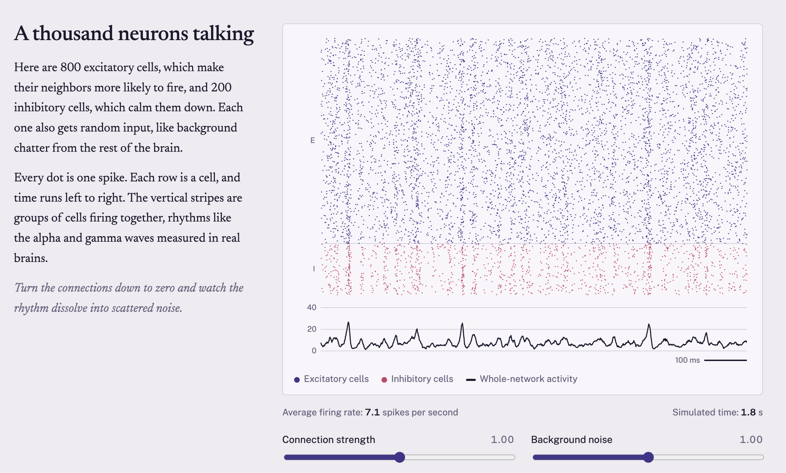
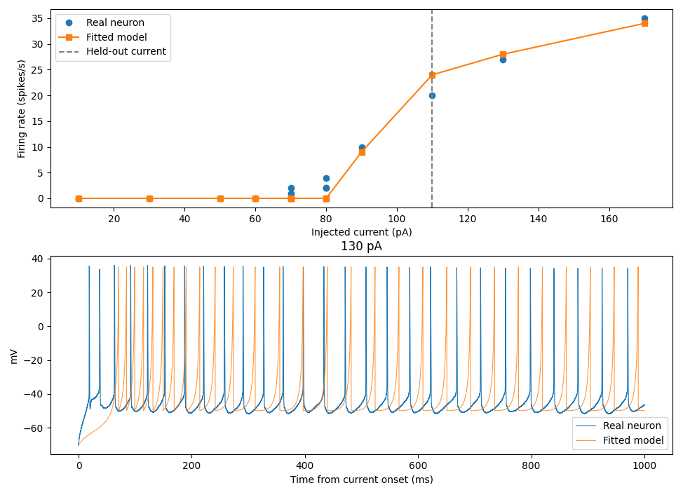

# A neuron on your screen

Live, interactive simulations of how brain cells fire, from a single neuron up to a network of a thousand, plus a model fitted to recordings from a real mouse neuron. The simulations run in the browser, straight from the equations.

**[Try it live →](https://sukiraharris.github.io/Neuron-Simulator/)**



## What's inside

**One neuron, the Hodgkin–Huxley way.** A full implementation of the 1952 Hodgkin–Huxley model, the Nobel Prize-winning description of how sodium and potassium currents produce an action potential. You can adjust the input current and the sodium and potassium conductances, and watch the membrane voltage and the three gating variables (m, h, n) in real time.

**Different cells, different rhythms.** The Izhikevich (2003) model reproduces the firing patterns of real cortical neurons with only two equations and four parameters. Switch between regular spiking, intrinsically bursting, chattering, and fast-spiking cells to see how each responds when current turns on.

**A thousand neurons talking.** A network of 800 excitatory and 200 inhibitory Izhikevich neurons with random all-to-all connections and noisy background input. The raster plot shows every spike, and the population trace below it shows the network's collective rhythm. Changing connection strength moves the network between synchronized alpha/gamma-like oscillations and unstructured firing.

**Fit to a real neuron.** An Izhikevich model fitted to whole-cell recordings from a mouse cortical pyramidal neuron in the Allen Cell Types Database, tested on a current it never saw during fitting. See [below](#fitting-the-model-to-a-real-neuron).

## How it works

- Hodgkin–Huxley equations integrated with forward Euler at 0.01 ms steps, using the classic squid giant axon parameters.
- Izhikevich neurons integrated at 0.25 ms (single cell) and 1 ms with two half-steps for membrane voltage (network), following Izhikevich (2003).
- Network connectivity stored as a flat 1000 × 1000 `Float32Array` in column-major order, so each spike adds one contiguous column to the input vector.
- Simulations pause automatically when scrolled off-screen, and start paused if the viewer prefers reduced motion.
- Plain HTML, CSS, and JavaScript with canvas rendering. No libraries or build step.

## Fitting the model to a real neuron

The simulator above uses textbook parameters. To test whether a simple model can capture a real cell, I fitted an Izhikevich model to whole-cell recordings from a mouse cortical neuron in the [Allen Cell Types Database](https://celltypes.brain-map.org/).



### Data

I selected cell **489753277**, a spiny (excitatory pyramidal) neuron, using the Allen database's precomputed features. I looked for cells with a steep F–I curve, clear spike-frequency adaptation, and a healthy resting potential (about −70 mV). The recordings are 1-second current steps ("Long Square" sweeps) from −110 to +170 pA.

From each sweep I extracted firing rate, first and last interspike interval (adaptation), ISI coefficient of variation (regularity), mean trough voltage between spikes, and first-spike latency.

### Model

I used Izhikevich's 2007 formulation, which works in physical units (mV, pA, pF):

```
C dv/dt = k(v − vr)(v − vt) − u + I
du/dt   = a[b(v − vr) − u]
if v ≥ vpeak:  v ← c,  u ← u + d
```

vr was fixed at the cell's measured resting potential (−70 mV) and vpeak at 35 mV. The other seven parameters were fitted with SciPy's differential evolution. The simulation is compiled with Numba so the optimizer can run thousands of evaluations quickly.

| Parameter | Meaning | Fitted value |
|---|---|---|
| C | Membrane capacitance (pF) | 261 |
| k | Voltage sensitivity | 1.28 |
| vt | Threshold voltage (mV) | −55.3 |
| a | Recovery time scale | 0.0045 |
| b | Recovery sensitivity | 4.67 |
| c | Reset voltage (mV) | −49.8 |
| d | After-spike recovery jump | 25.0 |

Some of these values line up with the physiology. The reset voltage c (−49.8 mV) is almost exactly the real cell's trough voltage between spikes (about −50 mV). The small recovery rate a gives the recovery variable a time constant of about 220 ms, which produces the gradual adaptation across the 1-second step.

### Results

The 110 pA sweep was held out of fitting and used only to test the model.

| Current | Real (spikes/s) | Model (spikes/s) |
|---|---|---|
| 90 pA | 10 | 9 |
| **110 pA (held out)** | **20** | **24** |
| 130 pA | 27 | 28 |
| 170 pA | 35 | 34 |

The model reproduces the cell's F–I curve, regular spiking, and between-spike trough voltage, and predicts the held-out current within about 20%.

### What I learned from the loss function

The fit went through several rounds, and each one exposed a different way the optimizer could satisfy the loss without matching the cell.

1. **Bursting.** Fitting only firing rate and first/last ISI produced a model that fired in bursts. Both measured ISIs fell inside a burst, so the loss could not tell the difference. Adding ISI regularity (CV) fixed this.
2. **Doublets and deep troughs.** The model then fired in pairs, with troughs near −72 mV instead of −50 mV. Adding trough voltage to the loss fixed both problems together.
3. **Avoiding the penalty.** Adding first-spike latency caused the optimizer to raise the model's threshold, so that near-threshold sweeps produced no spikes and escaped the latency penalty. Restricting latency to strong sweeps removed that loophole but led to overfitting: training points matched closely, but the held-out prediction fell to 12 against a real 20.

### Limitations

- **First-spike latency.** The real cell fires about 20 ms after current onset, and the model about 60 ms. The fitted capacitance (261 pF) is high, which slows the model's initial depolarization and likely accounts for the delay. Constraining latency consistently hurt held-out accuracy, which suggests this two-variable model cannot capture both the fast onset and the F–I relationship. The real cell likely has onset dynamics the model does not include.
- **Near-threshold variability.** At 70–80 pA, the real cell fires 0–4 spikes across repeated trials. The model is deterministic and cannot reproduce this.
- **Sensitivity to loss weights.** Changing the regularity weight from 100 to 200 moved the held-out prediction from 26 to 24 spikes/s. The final model uses 200.
- **One cell.** The fit is for a single neuron. Fitting across many cells would show how well the approach generalizes.

### Reproduce the fit

```bash
uv venv --python 3.11 venv && source venv/bin/activate
uv pip install allensdk matplotlib scipy numba
python fitting/pick_cell.py     # find candidate cells
python fitting/features.py      # extract features from the recordings
python fitting/fit.py           # fit the model and plot results
```

The first run downloads the cell's recordings (a few hundred MB) into `cell_types/`, which is excluded from the repo by `.gitignore`.

## Run the simulator locally

Open `index.html` in any browser.

## References

- Hodgkin, A. L., & Huxley, A. F. (1952). A quantitative description of membrane current and its application to conduction and excitation in nerve. *The Journal of Physiology*, 117(4), 500–544.
- Izhikevich, E. M. (2003). Simple model of spiking neurons. *IEEE Transactions on Neural Networks*, 14(6), 1569–1572.
- Izhikevich, E. M. (2007). *Dynamical Systems in Neuroscience: The Geometry of Excitability and Bursting*. MIT Press.
- Allen Institute for Brain Science. Allen Cell Types Database. Available from [celltypes.brain-map.org](https://celltypes.brain-map.org/).

---

Built by [Sukira Harris](https://sukiraharris.github.io/Personal-Website/).
